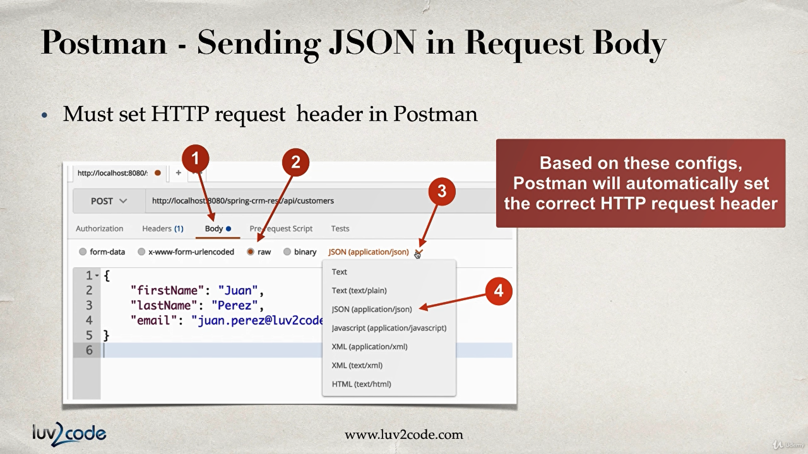

### README :

### if `customerId` id not found in database, jackson will return empty body. 

### jackson will convert request body from JSON to POJO

### `@RequestBody` annotation binds the POJO to a method parameter.

###         theCustomer.setId(0)  ----> 0 mean `empty` or `null` in dao.

+ if rest client is sending a request to `add` using `HTTP POST`.
+ then we ignore any id sent in the request.
+ we override the id with 0, to effectively set it to null/empty.
+ then our backend DAO code will `insert` new customer.

